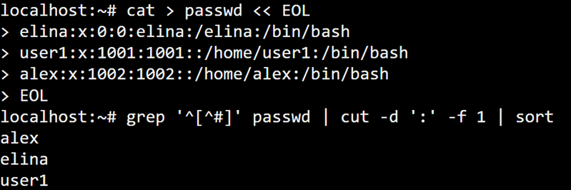
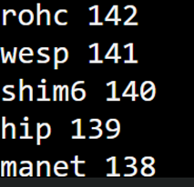
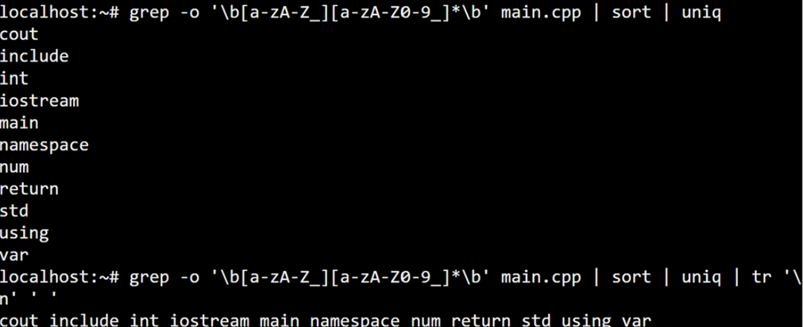
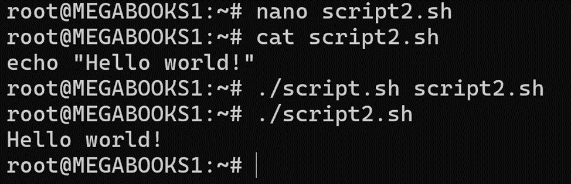
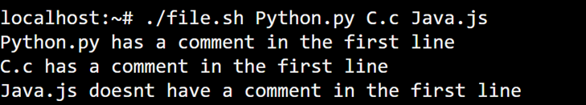
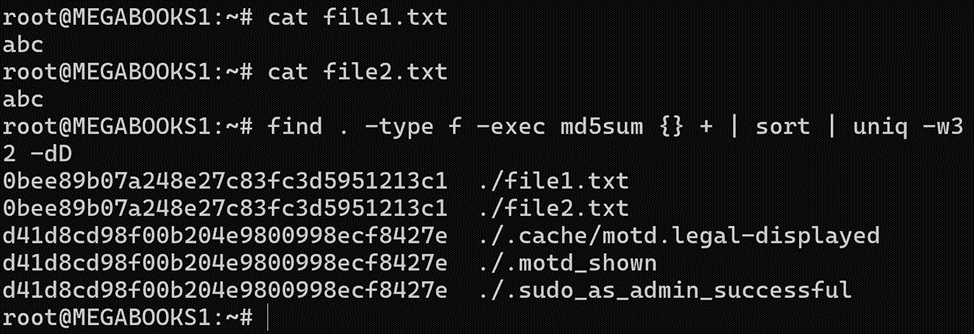
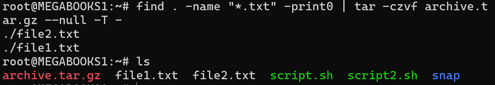
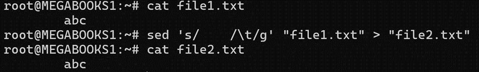
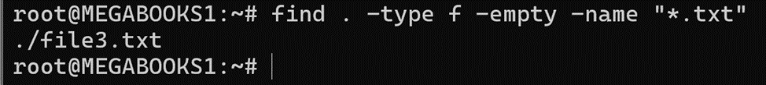

# Задача 1
Вывести отсортированный в алфавитном порядке список имен пользователей в файле passwd.
```
grep '^[^#]' passwd | cut -d ':' -f 1 | sort
```


 
# Задача 2
Вывести данные /etc/protocols в отформатированном и отсортированном порядке для 5 наибольших портов.
```
cat /etc/protocols | tail -n 5 | sort -nrk2 | awk '{print $2, $1}'
```


# Задача 3
Написать программу banner средствами bash для вывода текстов, как в следующем примере (размер баннера должен меняться!)
```
#!/bin/bash
string=$1
size=${#string}
echo -n "+"
for ((i=-2;i<size;i++))
do
echo -n "-"
done
echo "+"
echo "| $string |"
echo -n "+"
for ((i=-2;i<size;i++))
do
echo -n "-"
done
echo "+"
```
 


# Задача 4
Написать программу для вывода всех идентификаторов (по правилам C/C++ или Java) в файле (без повторений).
```
grep -o '\b[a-zA-Z_][a-zA-Z0-9_]*\b' main.cpp | sort | uniq | rt '\n' ' '
 ```


# Задача 5
Написать программу для регистрации пользовательской команды (правильные права доступа и копирование в /usr/local/bin).
```
#!/bin/bash
chmod +x "$1"
sudo cp "$1" /usr/local/bin/
```



# Задача 6
Написать программу для проверки наличия комментария в первой строке файлов с расширением c, js и py.
```
#!/bin/bash
for file in "$@"; do
  if [[ "$file" =~ \.(c|js|py)$ ]]; then
    first_line=$(head -n 1 "$file")
    if [[ "$first_line" =~ ^# ]] || [[ "$first_line" =~ ^// ]]; then
      echo "$file has a comment in the first line."
    else
      echo "$file does not have a comment in the first line."
    fi
  fi
done
```



# Задача 7
Написать программу для нахождения файлов-дубликатов (имеющих 1 или более копий содержимого) по заданному пути (и подкаталогам).
 ```
find . -type f -exec md5sum {} + | sort | uniq -w32 -dD
```


# Задача 8
Написать программу, которая находит все файлы в данном каталоге с расширением, указанным в качестве аргумента, и архивирует все эти файлы в архив tar.
```
find . -name "*.$1" -print0 | tar -czvf archive.tar.gz --null -T –
```


# Задача 9
Написать программу, которая заменяет в файле последовательности из 4 пробелов на символ табуляции. Входной и выходной файлы задаются аргументами.
```
sed 's/    /\t/g' "$1" > "$2"
```

 

# Задача 10
Написать программу, которая выводит названия всех пустых текстовых файлов в указанной директории. Директория передается в программу параметром.
```
find "$1" -type f -empty -name "*.txt"
```



